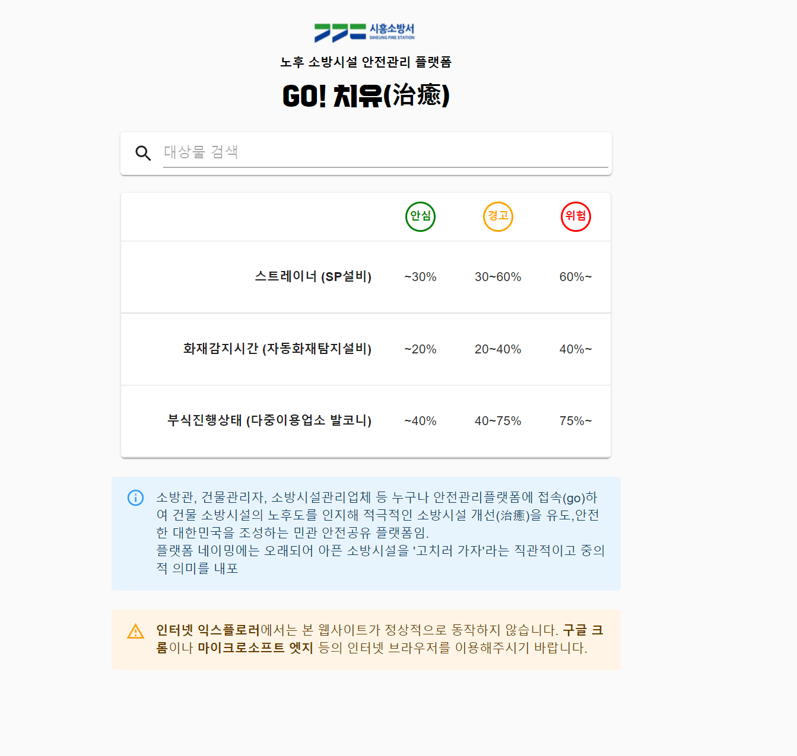
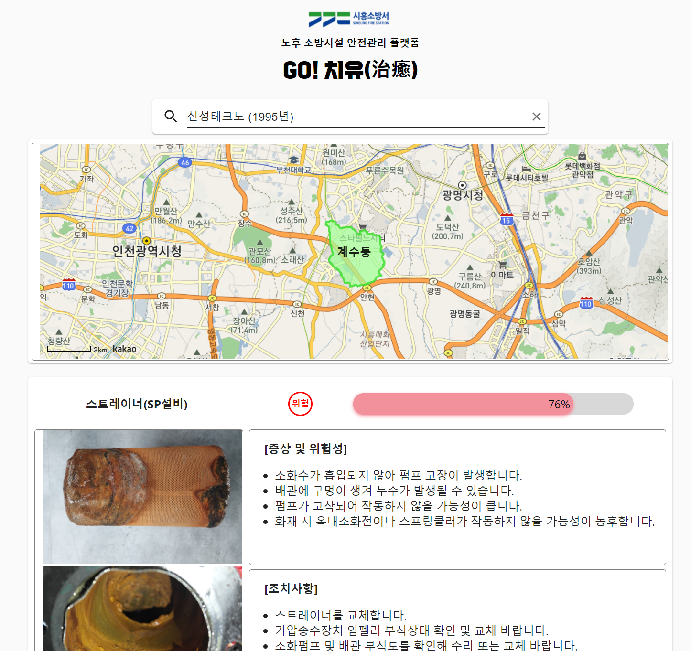

# Go! 치유 - 시흥소방서 안전컨설팅 플랫폼

[제 33회 소방정책컨퍼런스](https://www.nfsa.go.kr/nfsa/releaseinformation/archive/0011/?boardId=bbs_0000000000000370&mode=view&cntId=123&category=%EC%A0%9C33%ED%9A%8C&pageIdx=&searchCondition=&searchKeyword=) 소방시설 경년변화에 따른 노후도 분석과 화재 안전성 확보를 위한 대응방안(경기소방재난본부)에서 컨설팅을 위해 제작된 웹앱입니다.

Demo: [https://siheung-consulting.web.app](https://siheung-consulting.web.app)

||
|---|---|

메인 화면에서 대상물 검색 시, 오른쪽 이미지처럼 해당 대상물의 노후도를 progress bar 형식으로 나타냅니다.

### 참고한 코드
- [ProgressBar](https://www.csscodelab.com/custom-react-js-progress-bar/)
